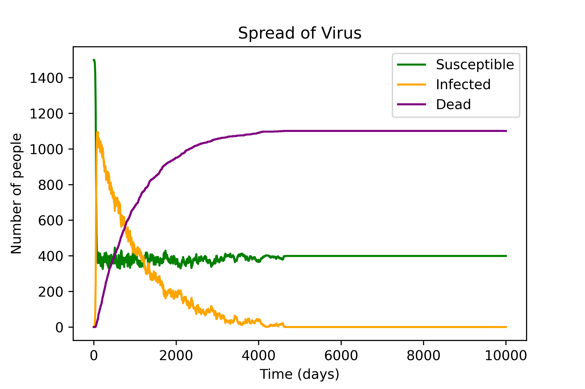
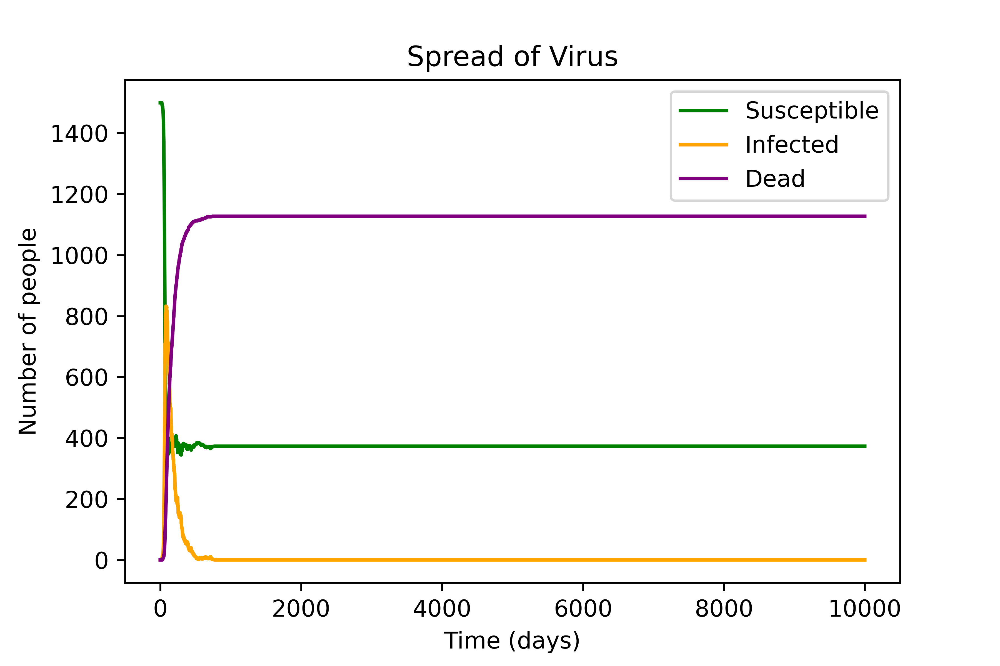
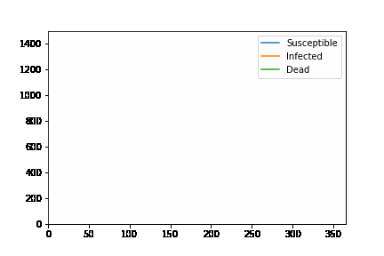

# MACS
Trabalho Semestral de Ciência de Dados
Grupo: Anna Karen, Cauê Santos, Matheus Zaia e Samira

APRESENTAÇÃO GERAL DO TRABALHO

O nosso trabalho semestral teve como objetivo fazer uma simulação de doenças dentro de uma população, com a opção de visualizar essa dinãmica através de um gráfico e de um gif. O modelo matemático utilizado para a nossa simulação foi uma variação do modelo epidemiológico SIR (Suscetíveis-Infectados-Recuperados), desenvolvido por McKendrick e Kermack em 1927, e entre as doenças que podem ser estudadas com este modelo encontram-se a Rubéola, o Sarampo e a Varíola. O modelo é baseado em equações diferenciais, e no nosso código utilizamos uma abordagem recursiva para a interação das classes de pessoas (susceptíveis, infectados e mortos).

Cada doença apresenta um comportamento diferente dentro da população, e isso é refletido nos parâmetros que usamos no nosso modelo, sendo todos eles escolhidos pelo usuário. Os parâmetros são: 

- Número de pessoas na população 
- Número inicial de infectados 
- Número inicial de mortes
- Número inicial de recuperados 
- Taxa de infecção do patógeno
- Taxa de recuperação dos infectados 
- Taxa de mortalidade do patógeno 
- Tempo de duração (em dias) da simulação

Com o nosso código, o usuário pode ter uma noção básica do comportamento de uma doença em meio à uma população através dos gráficos obtidos, assim como ter uma noção básica de como os parâmetros da doença afetam o seu desenvolvimento dentro da população. O modelo matemático utilizado possui algumas limitações, como o fato de quando fixamos as taxas de infecção e recuperação, e aumentamos a taxa de mortalidade, o número de mortos sempre chega em um mesmo valor final. Isso acontece devido a forma como o nosso modelo matemático foi desenvolvido, e para realizar simulações mais complexas, precisaríamos de um modelo matemático mais avançado. 

Mesmo com certas limitações, conseguimos ver comportamentos coerentes com a nossa simulação: novamente com as taxas de infecção e recuperação fixadas, conforme aumentamos a taxa de mortalidade o número de mortos cresce mais rapidamente, apesar de chegarmos sempre no mesmo valor crítico de mortos. 

Nosso código também pode servir como 'esqueleto' para outros tipos de simulação, afinal, dadas as regras sobre como o seu sistema evolui com o tempo, o usuário poderia facilmente modificar o código a fim de utilizá-lo para um outro tipo de simulação com comportamento parecido, como o crescimento de populações, por exemplo. O usuário também pode utilizar o código para adicionar mais complexidade a simulação de doenças, como implementar o sistema de ondas de reinfecção, políticas de lockdown, vacinação, dentre outros fatores que podem ser modelados matematicamente. 

COMO USAR O CÓDIGO

Nosso código, que está no arquivo 'MACS.ipynb', consiste em 3 funções: 'simulate_virus_spread', que gera os dados da nossa simulação; 'plotagem', que gera o gráfico para essa simulação e salva essa imagem; e 'gera_gif', que gera um gif do gráfico e salva ele. 

A função 'simulate_virus_spread' recebe 8 argumentos, sendo eles os parâmetros da simulação: 

- N (número total de pessoas do sistema) 
- I0 (número inicial de pessoas infectadas)
- D0 (número inicial de pessoas mortas)
- R0 (número inicial de pessoas infectadas)
- beta (taxa de infecção)
- gamma (taxa de recuperação)
- mu (taxa de mortalidade) 
- t_max (tempo de duração da simulação)

Como retorno, ela devolve 3 listas que mostram a evolução do nosso sistema, sendo o primeiro retorno a lista 'susceptible', o segundo a lista 'infected' e por último a lista 'dead'. A função recebe os parâmetros da simulação, utiliza a modelagem que adaptamos do modelo SIR, e retorna as listas em questão. 

As duas outras funções, 'plotagem' e 'gera_gif', são opções de visualização dos dados obtidos da função 'simulate_virus_spread', sendo  'plotagem' para gerarmos um gráfico, e 'gera_gif' para gerar um gif. 

A função 'plotagem' recebe 4 argumentos: 

- s (lista com as pessoas susceptíveis, obtida pela função 'simulate_virus_spread')
- i (lista com as pessoas infectadas, obtida pela função 'simulate_virus_spread')
- m (lista com as pessoas mortas, obtida pela função 'simulate_virus_spread')
- string (uma string com o nome do arquivo .png)

Seu retorno é uma imagem .png com o nome da variável 'string'.

A função 'gera_gif' recebe 9 argumentos:

- N (número total de pessoas do sistema) 
- I0 (número inicial de pessoas infectadas)
- D0 (número inicial de pessoas mortas)
- R0 (número inicial de pessoas infectadas)
- beta (taxa de infecção)
- gamma (taxa de recuperação)
- mu (taxa de mortalidade) 
- tempo (tempo de duração da simulação)
- nome_arquivo (string com o nome do arquivo .gif)

Seu retorno é um gif .gif com o nome da variável 'nome_arquivo'.

Para deixarmos o código mais interativo para o usuário, fizemos a inserção de parâmetros através da função 'input()', perguntando também se o usuário quer gerar uma imagem ou um gif. Ou seja, teremos várias perguntas antes do código gerar a imagem ou o gif, como "Você deseja gerar um gráfico (1) ou um gif (2)?", dentre outras perguntas para recolhermos as informações que o usuário necessita inserir para o funcionamento da simulação. 

EXEMPLOS

Vamos utilizar os seguintes parâmetros para o primeiro gráfico que será deixado como exemplo: 

- N = 1500
- I0 = 1
- D0 = 0
- R0 = 0
- beta = 0.2
- gamma = 0.05
- mu = 0.001
- tempo = 10000

Para o segundo gráfico vamos utilizar os mesmos parâmetros, porém, subindo a taxa de mortalidade em 10 vezes, para mostrarmos a limitação do modelo utilizado:

- N = 1500
- I0 = 1
- D0 = 0
- R0 = 0
- beta = 0.2
- gamma = 0.05
- mu = 0.01
- tempo = 10000

Vemos que mesmo subindo a taxa de mortalidade, o número máximo de mortos não se altera, deixando os outros parâmetros fixos. Isso sempre vai acontecer, se deixarmos a simulação rodar por tempo o suficiente.

Não conseguimos inserir um exemplo de gif aqui no README.mb, porém, abaixo estão os parâmetros que utilizamos para gerar o gif 'Gif teste.gif':

- N = 1500
- I0 = 1
- D0 = 0
- R0 = 0
- beta = 0.2
- gamma = 0.05
- mu = 0.01
- tempo = 365
  

